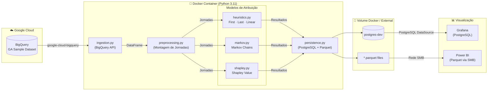
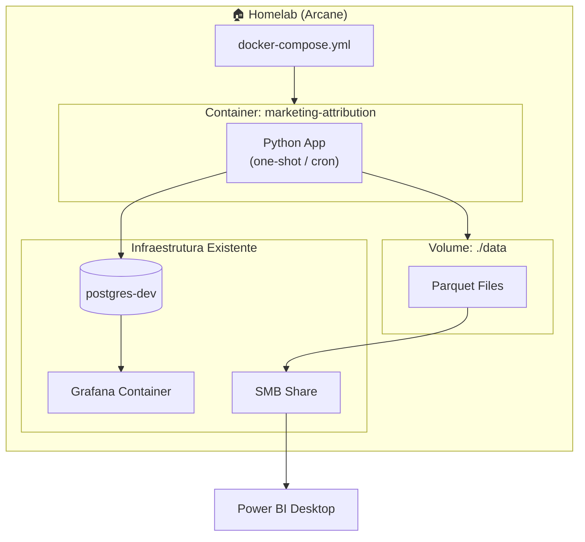
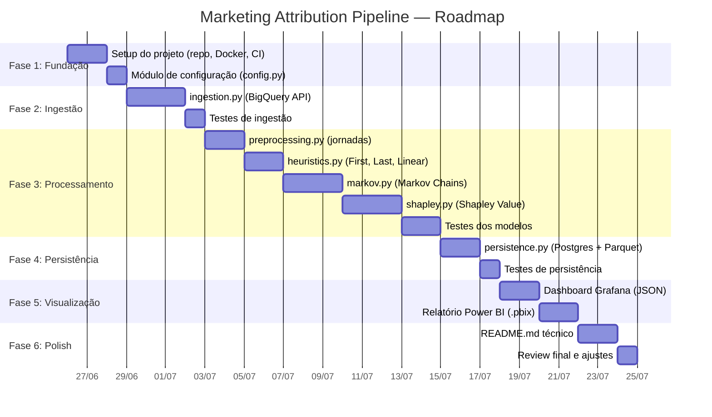

# 📄 PRD: Omni-Channel Marketing Attribution Pipeline

> **Versão**: 2.0 | **Última Atualização**: 2026-06-26  
> **Autor**: Leonardo (Anotther) | **Status**: Em Desenvolvimento

---

## 1. Resumo Executivo

Pipeline containerizado de atribuição de marketing multi-touch que processa jornadas de usuários do Google Analytics (BigQuery), aplica cinco modelos de atribuição (First-Click, Last-Click, Linear, **Markov Chains** e **Shapley Value**) e gera outputs estruturados no PostgreSQL e em Parquet. Os resultados alimentam dashboards interativos em Grafana e Power BI, permitindo decisões baseadas em dados sobre alocação de orçamento de marketing.

### Métricas de Sucesso

| Métrica | Target |
|---------|--------|
| Cobertura de modelos implementados | 5/5 (First, Last, Linear, Markov, Shapley) |
| Tempo de processamento end-to-end | < 5 min para dataset completo |
| Taxa de jornadas processadas | > 95% do dataset de entrada |
| Outputs gerados | PostgreSQL + Parquet validados e consumíveis |
| Dashboards funcionais | Grafana + Power BI conectados |

---

## 2. Problema & Oportunidade

### Problema

A atribuição de marketing tradicional (Last-Click) é um modelo simplista que distorce a contribuição real de cada canal na jornada de conversão. Canais de awareness (Display, Social) são sistematicamente desvalorizados, enquanto canais de conversão (Search Pago, Direto) recebem crédito desproporcional. Isso leva a decisões sub-ótimas na alocação de orçamento.

### Oportunidade

Aplicar modelos estatísticos avançados — **Markov Chains** (probabilístico) e **Shapley Value** (teoria dos jogos cooperativos) — para distribuir o crédito de conversão de forma matemática e justa entre todos os touchpoints da jornada do usuário. Isso demonstra proficiência em:

- **Engenharia de Dados**: Ingestão, transformação e persistência de dados em escala
- **Modelagem Estatística**: Implementação de modelos probabilísticos e game-theoretic
- **DevOps/Containerização**: Docker, volumes compartilhados, integração com homelab
- **Visualização de Dados**: Grafana (operacional) + Power BI (executivo)

### Stakeholders

| Stakeholder | Interesse |
|------------|-----------|
| Portfolio pessoal | Demonstração técnica end-to-end |
| Recrutadores/Avaliadores | Código modular, testado, documentado |
| Comunidade open-source | Implementação de referência em Python |

---

## 3. Objetivos & KPIs

### Objetivos Primários

1. **OBJ-1**: Implementar pipeline completo de ingestão → processamento → persistência → visualização
2. **OBJ-2**: Calcular atribuição por 5 modelos distintos e comparar resultados
3. **OBJ-3**: Containerizar a aplicação para execução one-shot ou agendada no homelab

### KPIs Técnicos

| KPI | Definição | Forma de Medição |
|-----|-----------|-----------------|
| Completude funcional | Todos os RFs implementados | Checklist de testes |
| Qualidade do código | Type hints, docstrings, linting | `mypy`, `ruff`, `pytest --cov` |
| Reprodutibilidade | Qualquer pessoa consegue rodar | `docker compose up` funciona do zero |
| Documentação | README autoexplicativo | Review externo |

---

## 4. Arquitetura do Sistema

### 4.1 Visão Geral — Fluxo de Dados



### 4.2 Arquitetura no Homelab (Arcane)

O projeto integra-se ao ecossistema de homelab gerenciado pelo **Arcane** com foco em simplicidade:



**Princípios de Integração:**
- **Banco Analítico** — PostgreSQL externo via `DATABASE_URL`
- **Compartilhamento via Volume Docker** — sem APIs adicionais, sem service mesh
- **Container efêmero** — executa, gera dados, encerra (mode one-shot)
- **Agendamento opcional** — via cron do host ou restart policy do Docker

---

## 5. Requisitos Funcionais

### Módulo 1: Ingestão de Dados (BigQuery API)

| ID | Requisito | Critério de Aceitação |
|----|-----------|----------------------|
| **RF1.1** | Autenticação via Service Account GCP com permissão de leitura no BigQuery | Container conecta ao BQ sem erro de auth; credentials **não** commitados no git |
| **RF1.2** | Extrair dados do `bigquery-public-data.google_analytics_sample.ga_sessions_*` usando `google-cloud-bigquery` | Query retorna dados com campos: `fullVisitorId`, `channelGrouping`, `visitNumber`, `totals.transactions`, `totals.transactionRevenue`, `date` |
| **RF1.3** | Limpar e transformar dados brutos usando `pandas` | Nulos tratados, tipos corretos, revenue convertido de micros (÷10⁶), log de registros descartados |
| **RF1.4** | Suportar parâmetros configuráveis para date range da extração | ENV vars ou config YAML para `START_DATE` e `END_DATE` |

### Módulo 2: Pré-processamento & Montagem de Jornadas

| ID | Requisito | Critério de Aceitação |
|----|-----------|----------------------|
| **RF2.1** | Agrupar sessões em jornadas de usuário (sequência de canais até conversão) | Cada jornada é uma lista ordenada de canais por `fullVisitorId` + `visitNumber` |
| **RF2.2** | Identificar jornadas conversoras vs. não-conversoras | Flag booleana `converted` baseada em `totals.transactions > 0` |
| **RF2.3** | Gerar estatísticas de jornadas | Total de jornadas, taxa de conversão, comprimento médio, canais únicos |

### Módulo 3: Modelos de Atribuição

| ID | Requisito | Critério de Aceitação |
|----|-----------|----------------------|
| **RF3.1** | **First-Click**: 100% do crédito ao primeiro touchpoint | Validar que soma dos créditos = total de conversões |
| **RF3.2** | **Last-Click**: 100% do crédito ao último touchpoint | Validar que soma dos créditos = total de conversões |
| **RF3.3** | **Linear**: Crédito distribuído igualmente entre todos os touchpoints | Validar que soma = total e cada step recebe 1/n |
| **RF3.4** | **Markov Chains**: Calcular matriz de transição e "Removal Effect" por canal usando `networkx` | Remoção de cada canal deve resultar em queda mensurável na taxa de conversão; créditos normalizados para 100% |
| **RF3.5** | **Shapley Value**: Distribuir crédito baseado em contribuições marginais de cada canal | Propriedades de Shapley satisfeitas: eficiência (soma = total), simetria, jogador nulo, aditividade |
| **RF3.6** | Consolidar resultados dos 5 modelos em DataFrame unificado | Colunas: `channel`, `first_click`, `last_click`, `linear`, `markov`, `shapley`; tipo `float64` |

### Módulo 4: Persistência & Exportação

| ID | Requisito | Critério de Aceitação |
|----|-----------|----------------------|
| **RF4.1** | Escrever resultados no banco PostgreSQL | Dados acessíveis na rede |
| **RF4.2** | Tabela `fato_jornadas`: jornadas completas com metadata | Schema definido, dados inseridos, queryable |
| **RF4.3** | Tabela `dim_canais`: dimensão de canais com métricas agregadas | Schema definido, unique por canal |
| **RF4.4** | Tabela `resultados_atribuicao`: resultados dos 5 modelos | Schema definido, 1 row por canal × modelo |
| **RF4.5** | Exportar resultados para `.parquet` na pasta `data/` | Arquivos Parquet válidos, legíveis por Power BI e pandas |
| **RF4.6** | Implementar idempotência — reexecução gera os mesmos resultados | Tabelas limpas antes de inserção (REPLACE ou DROP+CREATE) |

### Módulo 5: Visualização

| ID | Requisito | Critério de Aceitação |
|----|-----------|----------------------|
| **RF5.1** | Dashboard Grafana JSON com gráfico de barras comparando receita por modelo | JSON importável, dados renderizados corretamente |
| **RF5.2** | Dashboard Grafana com funil de conversão segmentado por canal | Visualização de funil funcional |
| **RF5.3** | Relatório Power BI (.pbix) com ROI por canal baseado em Markov | Arquivo .pbix com conexão Parquet funcionando |

---

## 6. Requisitos Não-Funcionais

| Categoria | Requisito | Especificação |
|-----------|-----------|---------------|
| **Performance** | Processamento do dataset completo | < 5 minutos em hardware de homelab |
| **Performance** | Memória do container | < 2GB RAM |
| **Confiabilidade** | Tratamento de erros | Logging estruturado com `logging` module; exit codes significativos |
| **Confiabilidade** | Retry de conexão BigQuery | 3 tentativas com backoff exponencial |
| **Segurança** | Credenciais GCP | Montadas via volume, nunca no git (`.gitignore`) |
| **Segurança** | Sem secrets hardcoded | Variáveis de ambiente para configuração sensível |
| **Manutenibilidade** | Qualidade do código | Type hints, docstrings, `ruff` linting, cobertura > 80% |
| **Manutenibilidade** | Testes unitários | `pytest` para cada módulo de modelo |
| **Portabilidade** | Reprodutibilidade | `docker compose up` funciona em qualquer máquina com Docker |
| **Observabilidade** | Logging | Logs estruturados com timestamp, nível, módulo, e métricas de execução |
| **Observabilidade** | Métricas de execução | Tempo por fase, registros processados, taxa de erro — escritos no log final |

---

## 7. Stack Tecnológica

| Componente | Tecnologia | Versão | Justificativa |
|-----------|------------|--------|---------------|
| **Runtime** | Python | 3.11 | LTS, performance, typing moderno |
| **Container** | Docker + docker-compose | Latest | Padrão de mercado, integração Arcane |
| **Base Image** | `python:3.11-slim` | — | Imagem leve (~150MB), sem overhead |
| **BigQuery Client** | `google-cloud-bigquery` | ≥3.x | SDK oficial do Google |
| **DataFrames** | `pandas` | ≥2.x | Standard para manipulação de dados |
| **Grafos/Markov** | `networkx` | ≥3.x | Biblioteca de grafos de referência em Python |
| **Banco Analítico** | `sqlalchemy` | ≥2.x | ORM/Conexão PostgreSQL |
| **Parquet** | `pyarrow` | ≥15.x | Engine de Parquet de referência |
| **Testes** | `pytest` + `pytest-cov` | ≥8.x | Framework de testes padrão |
| **Linting** | `ruff` | ≥0.5 | Linter + formatter all-in-one, rápido |
| **Type Checking** | `mypy` | ≥1.x | Type checking estático |
| **Visualização Ops** | Grafana + PostgreSQL | Existente | Já no homelab |
| **Visualização Exec** | Power BI | Desktop | Leitura direta de Parquet |

---

## 8. Estrutura do Projeto

```
marketing-attribution/
├── .github/
│   └── workflows/
│       └── ci.yml                    # CI: lint, type-check, test
├── docs/
│   └── PRD.md                        # Este documento
├── docker-compose.yml                # Orquestração do container
├── Dockerfile                        # Build da imagem Python
├── requirements.txt                  # Dependências de produção
├── requirements-dev.txt              # Dependências de desenvolvimento
├── .env.example                      # Template de variáveis de ambiente
├── .gitignore                        # Ignora credentials/, data/, .env
├── README.md                         # Documentação principal
├── LICENSE                           # Licença do projeto
├── credentials/                      # 🔒 NÃO commitado
│   └── gcp-service-account.json
├── data/                             # 📁 Volume Docker — saída dos dados
│   ├── resultados_atribuicao.parquet
│   ├── fato_jornadas.parquet
│   └── funil_conversao.parquet
├── src/
│   ├── __init__.py
│   ├── main.py                       # Entrypoint: orquestra o pipeline
│   ├── config.py                     # Configurações e ENV vars
│   ├── ingestion.py                  # Conexão BigQuery e extração
│   ├── preprocessing.py              # Montagem das jornadas
│   ├── models/
│   │   ├── __init__.py
│   │   ├── base.py                   # Interface/ABC para modelos
│   │   ├── heuristics.py             # First-Click, Last-Click, Linear
│   │   ├── markov.py                 # Markov Chains (networkx)
│   │   └── shapley.py                # Shapley Value
│   └── persistence.py               # Salva no Postgres e exporta Parquet
├── tests/
│   ├── __init__.py
│   ├── conftest.py                   # Fixtures compartilhadas
│   ├── test_ingestion.py
│   ├── test_preprocessing.py
│   ├── test_heuristics.py
│   ├── test_markov.py
│   ├── test_shapley.py
│   └── test_persistence.py
└── dashboards/
    └── grafana_dashboard.json        # Dashboard pronto para importação
```

---

## 9. Modelo de Dados

### 9.1 Tabela `fato_jornadas`

| Coluna | Tipo | Descrição |
|--------|------|-----------|
| `journey_id` | `VARCHAR` (PK) | Hash único da jornada |
| `visitor_id` | `VARCHAR` | `fullVisitorId` do GA |
| `channel_path` | `VARCHAR[]` | Lista ordenada de canais |
| `path_length` | `INTEGER` | Número de touchpoints |
| `converted` | `BOOLEAN` | Se a jornada resultou em conversão |
| `transaction_revenue` | `DOUBLE` | Receita da conversão (0 se não converteu) |
| `first_visit_date` | `DATE` | Data da primeira sessão |
| `last_visit_date` | `DATE` | Data da última sessão |

### 9.2 Tabela `dim_canais`

| Coluna | Tipo | Descrição |
|--------|------|-----------|
| `channel_name` | `VARCHAR` (PK) | Nome do canal (channelGrouping) |
| `total_sessions` | `INTEGER` | Total de sessões do canal |
| `total_conversions` | `INTEGER` | Conversões onde o canal participou |
| `total_revenue` | `DOUBLE` | Receita total onde o canal participou |
| `avg_position` | `DOUBLE` | Posição média na jornada |
| `conversion_rate` | `DOUBLE` | Taxa de conversão do canal |

### 9.3 Tabela `resultados_atribuicao`

| Coluna | Tipo | Descrição |
|--------|------|-----------|
| `channel_name` | `VARCHAR` (PK) | Nome do canal |
| `first_click_credit` | `DOUBLE` | Crédito pelo modelo First-Click |
| `last_click_credit` | `DOUBLE` | Crédito pelo modelo Last-Click |
| `linear_credit` | `DOUBLE` | Crédito pelo modelo Linear |
| `markov_credit` | `DOUBLE` | Crédito pelo modelo Markov Chains |
| `shapley_credit` | `DOUBLE` | Crédito pelo modelo Shapley Value |
| `first_click_revenue` | `DOUBLE` | Receita atribuída (First-Click) |
| `last_click_revenue` | `DOUBLE` | Receita atribuída (Last-Click) |
| `linear_revenue` | `DOUBLE` | Receita atribuída (Linear) |
| `markov_revenue` | `DOUBLE` | Receita atribuída (Markov) |
| `shapley_revenue` | `DOUBLE` | Receita atribuída (Shapley) |

---

## 10. Plano de Entrega



### Milestones

| Milestone | Entregável | Critério de Done |
|-----------|-----------|-----------------|
| **M1: Foundation** | Repo + Docker + CI funcionando | `docker compose build` sem erros |
| **M2: Data In** | Dados do BigQuery extraídos e limpos | DataFrame com >10k sessões válidas |
| **M3: Models** | 5 modelos implementados e testados | Testes passando, créditos somam 100% |
| **M4: Data Out** | PostgreSQL + Parquet gerados | Arquivos queryáveis e validados |
| **M5: Viz** | Dashboards Grafana + Power BI | Screenshots no README |
| **M6: Ship** | README completo, CI green | Pronto para portfolio |

---

## 11. Riscos & Mitigações

| # | Risco | Probabilidade | Impacto | Mitigação |
|---|-------|:------------:|:-------:|-----------|
| R1 | Dataset do GA não acessível (billing, permissões) | Média | Alto | Manter dataset mock local para desenvolvimento; documentar setup do GCP |
| R2 | Shapley Value computacionalmente caro (2^n subsets) | Alta | Médio | Limitar a canais com >X sessões; implementar caching de coalizões |
| R3 | Conexão com Postgres falha | Baixa | Médio | Validar DATABASE_URL via wait-for-it |
| R4 | Schema do GA muda entre versões | Baixa | Baixo | Queries parametrizadas, validação de schema na ingestão |
| R5 | Container consome muita RAM | Média | Médio | Chunk processing no pandas, monitorar via `docker stats` |
| R6 | Credenciais GCP vazam no git | Baixa | **Crítico** | `.gitignore`, pre-commit hook, scan de secrets no CI |

---

## 12. Entregáveis

| # | Entregável | Formato | Critério de Done |
|---|-----------|---------|-----------------|
| E1 | Aplicação Python containerizada | `Dockerfile` + `docker-compose.yml` + código fonte | `docker compose up` executa sem erros |
| E2 | Relatório Técnico | `README.md` no repositório | Explica arquitetura, matemática (Markov/Shapley), e como rodar |
| E3 | Arquivos de dados | Tabelas no Postgres + `.parquet` na pasta `data/` | Gerados e validados pelo pipeline |
| E4 | Dashboard Grafana | `dashboards/grafana_dashboard.json` | Importável, renderiza dados reais |
| E5 | Relatório Power BI | `dashboards/attribution_report.pbix` | Conecta aos Parquet, mostra ROI por canal |
| E6 | Testes automatizados | `tests/` com pytest | Cobertura > 80%, CI green |
| E7 | CI Pipeline | `.github/workflows/ci.yml` | Lint + type-check + test em cada push |

---

## Apêndice A: Referências Técnicas

### Markov Chains para Atribuição

O modelo constrói um grafo dirigido onde:
- **Nós** = canais de marketing + estados `Start` e `Conversion`
- **Arestas** = probabilidades de transição entre canais
- **Removal Effect** = queda na taxa de conversão ao remover cada canal

$$RE_i = 1 - \frac{P(conversion | sem\ canal_i)}{P(conversion | todos)}$$

### Shapley Value para Atribuição

Baseado na teoria dos jogos cooperativos de Lloyd Shapley (Nobel 2012):

$$\phi_i = \sum_{S \subseteq N \setminus \{i\}} \frac{|S|! (|N|-|S|-1)!}{|N|!} [v(S \cup \{i\}) - v(S)]$$

Onde:
- $N$ = conjunto de todos os canais
- $S$ = coalizão (subset de canais)
- $v(S)$ = valor (conversões) gerado pela coalizão $S$
- $\phi_i$ = contribuição marginal média do canal $i$

---

## Apêndice B: BigQuery MCP — Integração para Desenvolvimento

O ambiente possui o **BigQuery MCP Server** instalado com as seguintes ferramentas úteis durante o desenvolvimento:

| Ferramenta | Uso no Projeto |
|-----------|---------------|
| `execute_sql` | Testar queries de extração interativamente |
| `get_table_info` | Explorar schema do GA sample dataset |
| `ask_data_insights` | Análise exploratória via NLP |
| `analyze_contribution` | Complementar análise de atribuição |
| `forecast` | Extensão futura — projeção de tendências |

> **Status**: MCP instalado, requer ativação das ferramentas e configuração do project ID correto.
